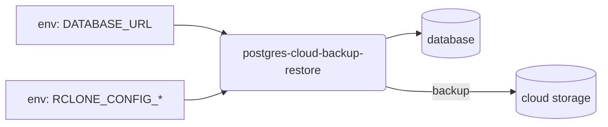
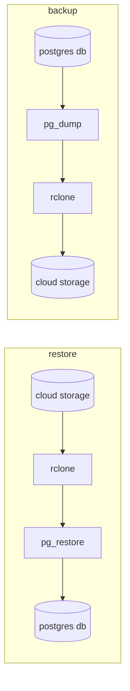

# Postgres automated backups to cloud storage

Automate postgres backups to any [supported cloud storage ](https://rclone.org/#providers).

Published images: [dockerhub](https://hub.docker.com/repository/docker/metapage/postgres-cloud-backup-restore)

Thin scripting wrapping cli tools: [`pg_dump`, `pg_restore`, and `rclone`]

**Configuration:**



**Tool pipeline:**



## How to make a backup

Minimal requirements:

1. Provide as env vars:
  - DATABASE_URL (e.g. e.g. `postgres://<user>:<password>@<address>:5432/<db-name>`)
  - RCLONE_URL (e.g. `aws:my-bucket/my-backups`)
  - RCLONE_CONFIG_* (see [docker-compose.yml](./docker-compose.yml) for an example using localstack. [rclone can be configured entirely with env vars](https://rclone.org/docs/#environment-variables)
2. Run the container with the env vars and create a backup:
```
metapage/postgres-cloud-backup-restore backup
```

## How to restore from a backup

1. Run the container with the env vars above and restore from a backup:
```
metapage/postgres-cloud-backup-restore restore <name of backup file>
```


## Cron backups

1. Run the container with the env vars above and schedule automated backups:
```
metapage/postgres-cloud-backup-restore cron "0 0 * * *"
```


## Env vars

See [rclone en vars](https://rclone.org/docs/#environment-variables) for the `rclone` requried env vars.


| env var      | Description |
| ----------- | ----------- |
| DATABASE_URL      | Connection URL: e.g. `postgres://<user>:<password>@<address>:5432/<db-name>` |
| DATABASE_BACKUP_ARGS   | Extra arguments passed to [pg_dump](https://www.postgresql.org/docs/14/app-pgdump.html) |
| DATABASE_RESTORE_ARGS   | Extra arguments passed to [pg_restore](https://www.postgresql.org/docs/14/app-pgrestore.html) |
| RCLONE_URL   | |
| SLACK_WEBHOOK_URL_ERROR   | |
| SLACK_WEBHOOK_URL_SUCCESS   | |
| SLACK_SUCCESS_MESSAGE   | |
| BACKUP_DIR   | |
